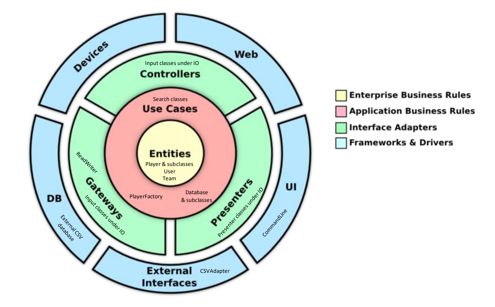

# Phase 2 Design Document

*Note: This document covers a lot of the same information as the [Phase 1 Design Document](https://github.com/CSC207-UofT/course-project-team-scouts/blob/main/phase1/design_document.md#packaging-strategy). In some sections, we include links to what we wrote in the previous phase to keep things concise.*

- [Specification and Walkthrough](#specification-and-walkthrough)
- [Major Design Decisions](#major-design-decisions)
  - [Phase 1](#phase-1)
  - [Phase 2](#phase-2)
- [Clean Architecture](#clean-architecture)
- [SOLID Design](#solid-design)
- [Packaging Strategy](#packaging-strategy)
- [Design Patterns](#design-patterns)
- [Progress Report](#progress-report)

## Specification and Walkthrough

See [`specification.md`](https://github.com/CSC207-UofT/course-project-team-scouts/blob/main/phase2/specification.md) for the final specification.

Also see [`walkthrough.md`](https://github.com/CSC207-UofT/course-project-team-scouts/blob/main/phase2/walkthrough.md) for the walkthrough which reflects the final specification.

*Note: Both documents have not changed very much since Phase 1. Our focus in Phase 2 was to implement everything in the specification, rather than broaden our scope further.*

## Major Design Decisions

### Phase 1

*Note: All of these decisions were mentioned in the [previous phase](../phase1/design_document.md#major_design_decisions), but many were a work in progress. Now they have all been implemented, and some details have changed slightly.*

- Created subclasses of player and implemented the **factory design pattern**
  - All players have the same kinds of attributes in our database, but depending on the type of player (forward, defense, goalkeeper, etc.), not all of those attributes are very relevant.
    - For example, when presenting a single defender, we aren't interested in their goalkeeping abilities.
  - To avoid multiple switch statements in our program, we use polymorphism instead, thus avoiding a [code smell](https://refactoring.guru/smells/switch-statements).
    - We are automatically provided with the appropriate `Player` subclass by `PlayerFactory`, without needing to specify the exact class of the object that will be created.
    - Each type of player has a unique `getPositionSkills` method that returns the skills (and associated values) that are most relevant to that type of player.
- Implemented the **builder design pattern** for the different types of inputs/searches
  - Our program offers two ways to search for players (by name or attributes), and the `InputBuilder` class decides which type of input to build based on the user's search preference. 
- Replaced `Scout` with a `User` class
  - Our new `User` class allows for additional functionality that wouldn't make sense with the `Scout` class.
    - *e.g.* a `Scout` shouldn't have a username and password if it is just another entity alongside players and teams.
- Made our Business Data (entities) serializable
  - One of the most important features included in the new specification is the ability to save the state of the program.
    - User profiles should be preserved across multiple runs of the program.
    - Any teams added by users should be kept in memory, as well as any changes made to player attributes.
  - To enable saving state, we have made all core entities serializable(`Player`s, `Team`s, `Users`, as well as the `Database` classes).
- Reworked our search/input classes
  - We wanted to make sure that when searching by attribute, the user only needs to specify values for the attributes that they care about (*e.g.* only defensive attributes).
  - We also wanted users to be able to specify a range of values if they want, or just specify a single value.
  - Our previous design, which used `PlayerPropertiesIterator` and a text file with a list of attributes, didn't allow for this flexibility in input.

### Phase 2

*Note: The [Progress Report](#progress-report) includes additional details about these design decisions.*

- Created a `Database` superclass
  - This new class has the methods `addEntity`, `setEntities` and `getEntities`. It also has an instance variable called `entityList` that keeps track of whatever objects are stored in the database.
  - The `TeamDatabase`, `PlayerDatabase`, and `UserDatabase` subclasses extend this class, thus inheriting the core functionality from the superclass.
  - The `TeamDatabase` and `UserDatabase` require specific functionality that is not shared with the other database classes, so they implement their own methods as necessary (*e.g.* `getUser()`).
- Made use of generics with multiple classes
  - Our new `Database` superclass uses generics, which allows subclasses to choose the specific type of object that they wish to store. For example, `PlayerDatabase` extends `Database<Player>`, which allows it to store only `Player` objects. 
    - Generics also ensure that the methods of the subclasses only accept or return a specific object. For example, `PlayerDatabase.setEntities()` will only take a list of `Player`s, not `User`s or `Team`s.
  - We have also used generics in `SearchByName`, which allows us to search for either `Player`s or `Team`s without writing extra code.
    - The object it searches for depends on how we initialize the class. For example, `SearchByName<Player> searchByName = new SearchByName<>();` will initialize a class that allows for player searching, and so the `search()` method will only accept a `PlayerDatabase` to search from.
- Made all database classes less static
  - Previously, each database had a public static list of entities that could be accessed from anywhere in the program.
  - This made testing more difficult, bugs more likely, and serialization impossible.
  - Now, each database has its own instance variable - a list of entities stored - and this variable can only be accessed by methods which take the database as an argument.
- Removed some responsibility from `CSVAdapter`
  - Previously, `CSVAdapter` was responsible for keeping track of the teams that have been added to the `TeamDatabase`.
    - Now, this logic has been extracted and put into the `TeamDatabase` class itself, thus reducing complexity.
  - We also eliminated the need for `stringToDouble()` by making all of `Player`'s attributes into integers, since there are no decimal values in our external database file.

## Clean Architecture

The following diagram gives an overview of how the different classes in our program fit into the layers of Clean Architecture. The [alternate version](images/ca_diagram_dependencies.png) also shows some of the dependencies in our program.

Ever since the inception of our project, we have worked to make our project and code adhere to the rules of Clean Architecture. 
To start with, our project doesn't rely on a rigid framework, which has allowed us to independently **expand the domain of our project** after each phase and not forced us to stay within certain constraints. This is mostly a consequence of keeping everything within a specific layer of Clean Architecture and adhering to dependency rules. 

For example, our core entities do not depend on our use case classes like the `Database` subclasses. Instead, the opposite is true. Additionally, if we *were* to make changes to the core entities, we still wouldn't have to modify our databases because they were implemented using generics. Another example of this is that we have substantially upgraded our UI without having to make significant changes to our core functionality in use cases and entity classes. This demonstrates that the outer layer of our program, where the UI resides, is highly **independent from the inner layers** of our program. This is the essence of Clean Architecture: **reducing dependencies** and allowing for **easy modification and extension**. 

A final example of how our code adheres to Clean Architecture is that each aspect of our program is **easily testable**, and can be tested independently from other aspects of the program, like the UI or external database. We have avoided (as much as possible) the **long method code smell**, so each method in our program has a very specific role. Hence we can test each and every small functionality of our code. This also helps in making our program easily extendable: new functionality can be implemented with additional small methods, rather than modifying huge existing methods.

## SOLID Design

<!-- TODO: Update this section to include any new info/changes -->

- Single Responsibility Principle
  - For the most part, our code follows the Single Responsibility Principle fairly well. Almost all of our classes are broken down well, with each one of them handling a single concern. 
    - For example, we have different search classes `SearchForPlayer` and `SearchByPlayerAttributes` for different kinds of search operations, thus avoiding a single class to handle two different kinds of search tasks. 
  - One domain where our project might not follow the Single Responsibility Principle, is with our dataset. 
    - Our classes, and our code in general, are highly dependent on the specific dataset we are using (`players_20.csv`). 
    - If we changed this dataset to one which does not contain the same player attributes, then we would have to modify almost every class in our program.
- Open/Closed Principle
  - In both Phase 1 and 2, we have focused on *extending* our code from Phase 0 while minimizing any *modification* of our existing code. 
    - Overall, our project has been open to extension while closed for modification, with some exceptions. 
  - We have added features like a **new login system**, **team creation feature**, and the ability to **save the state of the program**. All of these added features have not required existing classes to be modified very much.
  - Other changes in our project, like **updating the search methodology**, **upgrading presenter classes**, and especially **implementing the `Database` superclass**, *have* required changes to existing classes.
    - However, these changes will make future extensions easier. For example, if we were to add other entities to our program like coaches or managers, having the generic `Database` superclass would be really helpful.
- Liskov Substitution Principle
  - Our use of interfaces and parent classes allows many subtypes to be substituted for their parent classes.
  - For example, the `Defender`, `Goalkeeper`, and other subclasses of `Player`, as well as `Player` itself, can all be added to `PlayerDatabase` using the `addEntity` method.
      - The same is true for all the methods of `PlayersPresenter` and `PlayerStatsCalculator`.
- Interface Segregation Principle
  - The user is not forced to depend on methods it does not use in our code. 
    - For instance, the `InputPlayerName` and `InputPlayerAttributes` classes extend the `InputData` interface, therefore, when a client wants to search for a player by name, it does not need to worry about inputting attributes.
  - Additionally, all of our classes are specific enough that they only implement methods that they require, and we have avoided abstract classes or interfaces that enforce unnecessary methods.
    - *e.g.* Our `InputAdapter` interface only requires a `processFile` method, which takes in a database file, to be implemented. It is up to the concrete adapter class to decide what other methods (like `processRow` and `makeHashMap`) are necessary for proper functionality.
- Dependency Inversion Principle
  - We tried as much as possible to introduce layers of abstraction between higher level and lower level classes, mostly by using interfaces.
  - For example, the `main` method of our program (in `CommandLine`) class could have depended directly on the concrete `CSVAdapter` class, but we applied Dependency Inversion by adding an interface (`InputAdapter`) between these classes.
    - The lower level `CommandLine` (a UI class) depends on the `InputAdapter` interface, and the higher level `CSVAdapter` (a gateway class) implements this interface.

## Packaging Strategy

Our packaging strategy, "Packaging by Component," has not changed from Phase 1. Here is a snippet from the [Phase 1 Design Document](https://github.com/CSC207-UofT/course-project-team-scouts/blob/main/phase1/design_document.md#packaging-strategy):

> There are many packaging strategies we could have chosen to apply to our project's file structure, however, we came to the conclusion that the Packaging by Component strategy would fit our project best. We came to this conclusion by process of elimination; we considered how each of the strategies learned in class would organize all of the files in the project before settling on packaging by component.
>
> [...]
>
> Thus, we settled on Packaging by Component. This strategy allowed us to put files that correspond to a single feature or function in our program, such as presentation or searching, into the same package. This would be the easiest to look at and search through to find specific files, while also making it clear what all the different features of our program are, and which files are responsible for providing them.

## Design Patterns

In the [Phase 1 Design Document](https://github.com/CSC207-UofT/course-project-team-scouts/blob/main/phase1/design_document.md#design-patterns) (click for more details), we discussed the different design patterns we have implemented or considered. This includes:

- **Adapter design pattern**, implemented using the `InputAdapter` interface and `CSVAdapter` class.
- **Factory design pattern**, implemented using the `PlayerFactory` class.
- **Builder design pattern**, implemented using the `InputBuilder` class
  - Now uses an enum, `InputType`.
  - Now creates additional product classes: `InputLogin`, `InputTeamName`, `InputTeamAttributes`.
- **Decorator design pattern**, *NOT* implemented since it was unnecessary.

In Phase 2, we have not identified any additional design patterns that are applicable to our program.

## Progress Report

See [`phase2/progress_report.md`](https://github.com/CSC207-UofT/course-project-team-scouts/blob/main/phase2/progress_report.md).
